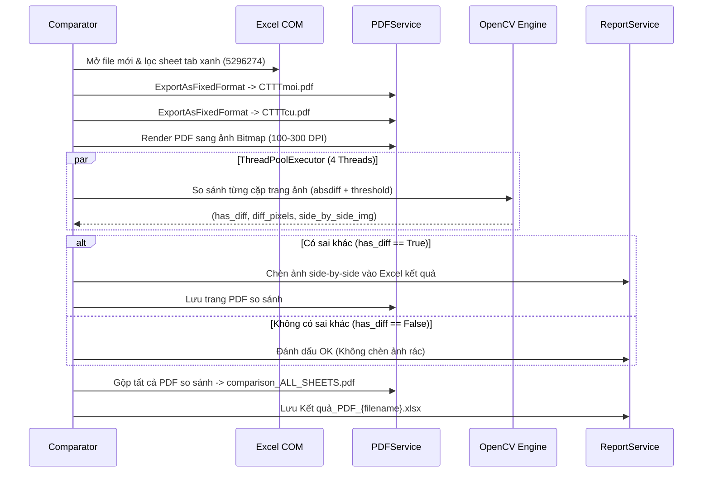
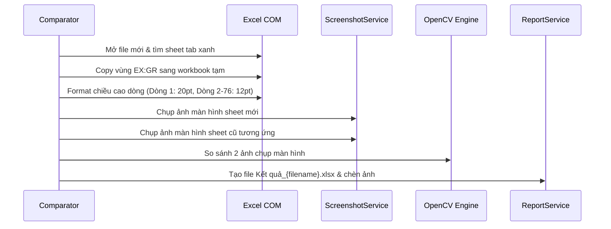

# 🏛️ ARCHITECTURE.md - Kiến Trúc Hệ Thống So Sánh CTTT (Refactored)

> **Tài liệu đặc tả kiến trúc kỹ thuật toàn diện cho Phần mềm So sánh Chứng Từ Thanh Toán (CTTT)**

---

## 1. Triết Lý Thiết Kế & Mục Tiêu Kiến Trúc

Dự án được tái cấu trúc từ mã nguồn nguyên khối (Monolithic 4,721 dòng lệnh trong `SosanhCTTT_phienban7.03_list_03.11.2025.py`) sang mô hình **Clean Architecture / Layered Service-Oriented Architecture** nhằm đạt được các mục tiêu sau:

1. **Phân tách trách nhiệm rõ ràng (Separation of Concerns)**: UI, Core Orchestration, Excel COM, PDF Engine, Image Processing và Reporting được tách biệt thành các module độc lập.
2. **Khả năng mở rộng & Đa chiến lược (Strategy Pattern)**: Dễ dàng chuyển đổi hoặc mở rộng giữa 2 phương pháp so sánh (PDF vector vs Screenshot Cut/Paste).
3. **Hiệu năng & Tối ưu tài nguyên (High Performance & Safety)**:
   - Tận dụng sức mạnh xử lý ma trận của OpenCV (cv2) thay vì PIL đơn luồng.
   - Song song hóa việc so sánh các trang với `ThreadPoolExecutor`.
   - Quản lý vòng đời tiến trình COM `EXCEL.EXE` độc lập, chống treo tiến trình ngầm (Orphan Processes).
4. **Tính tất định & Không phát sinh sai số (Deterministic Accuracy)**: Thuật toán so sánh điểm ảnh đảm bảo phát hiện chính xác 100% các khác biệt dù là nhỏ nhất (số liệu tài chính, ngày tháng, mã barcode).

---

## 2. Sơ Đồ Kiến Trúc Hệ Thống (System Diagram)

```mermaid
graph TB
    subgraph "Presentation Layer (UI)"
        MW[MainWindow / MainWindowModern]
        MS[ModernStyle]
        TR[Translations (vi/en)]
        UU[UI Utilities / DragDropListbox]
    end

    subgraph "Orchestration Layer (Core)"
        CMP[core.comparator.Comparator]
    end

    subgraph "Strategy Layer"
        STR_A[Strategy A: PDF Workflow]
        STR_B[Strategy B: Screenshot Workflow]
    end

    subgraph "Service Layer"
        EXC[services.excel_service.ExcelService]
        PDF[services.pdf_service.PDFService]
        IMG[services.optimized_image_compare]
        REP[services.report_service.ReportService]
        CLN[services.cleanup_service.CleanupService]
        SET[services.settings_service.SettingsService]
        UPD[services.update_service.UpdateService]
        HLP[services.help_service.HelpService]
        VAL[services.validation_service.ValidationService]
    end

    subgraph "Infrastructure & OS"
        COM[Windows Excel COM (pywin32)]
        FITZ[PyMuPDF (fitz)]
        CV[OpenCV (cv2)]
        LOG[utils.py / Logging UTF-8]
    end

    MW --> CMP
    MW --> SET
    MW --> UPD
    MW --> HLP
    MW --> TR
    MW --> MS
    MW --> UU

    CMP --> EXC
    CMP --> STR_A
    CMP --> STR_B
    CMP --> REP
    CMP --> CLN

    STR_A --> PDF
    STR_A --> IMG
    STR_B --> EXC
    STR_B --> IMG

    EXC --> COM
    PDF --> COM
    PDF --> FITZ
    IMG --> CV
    CMP --> LOG
```

---

## 3. Phân Rã Các Tầng (Layer Breakdown)

### 3.1. Presentation Layer (`ui/`)
- [`ui/main_window_modern.py`](file:///d:/Sandbox/pmsosanhCTTT/Refactored%20so%20s%C3%A1nh%20CTTT%20c%C5%A9%20m%E1%BB%9Bi/Refactored/ui/main_window_modern.py): Giao diện người dùng chính theo phong cách card-based hiện đại. Chứa luồng xử lý nền (Background Thread) tách rời khỏi UI thread để không làm đơ giao diện khi xử lý nặng.
- [`ui/modern_style.py`](file:///d:/Sandbox/pmsosanhCTTT/Refactored%20so%20s%C3%A1nh%20CTTT%20c%C5%A9%20m%E1%BB%9Bi/Refactored/ui/modern_style.py): Định nghĩa bảng màu (Palette), kiểu chữ (Font), bo góc nút bấm và hiệu ứng hover.
- [`ui/translations.py`](file:///d:/Sandbox/pmsosanhCTTT/Refactored%20so%20s%C3%A1nh%20CTTT%20c%C5%A9%20m%E1%BB%9Bi/Refactored/ui/translations.py): Quản lý từ điển i18n cho 2 ngôn ngữ Tiếng Việt và Tiếng Anh.
- [`ui/ui_utils.py`](file:///d:/Sandbox/pmsosanhCTTT/Refactored%20so%20s%C3%A1nh%20CTTT%20c%C5%A9%20m%E1%BB%9Bi/Refactored/ui/ui_utils.py): Hộp thoại kéo thả sắp xếp danh sách cặp file (`FilePairListbox`), Tooltip hover, thanh trạng thái (`StatusBar`).

### 3.2. Orchestration Layer (`core/`)
- [`core/comparator.py`](file:///d:/Sandbox/pmsosanhCTTT/Refactored%20so%20s%C3%A1nh%20CTTT%20c%C5%A9%20m%E1%BB%9Bi/Refactored/core/comparator.py): Lớp điều phối trung tâm (`Comparator`).
  - Tiếp nhận danh sách file mới và file cũ.
  - Thực hiện giai đoạn tiền xử lý (Preprocessing Phase).
  - Điều hướng tới **Strategy A** (PDF Workflow) hoặc **Strategy B** (Screenshot Workflow).
  - Khởi tạo thư mục kết quả dạng timestamp `Ket_qua_so_sanh_YYYYMMDD_HHMMSS`.
  - Quản lý thanh tiến trình và gọi callback trạng thái.

### 3.3. Service Layer (`services/`)
- [`services/excel_service.py`](file:///d:/Sandbox/pmsosanhCTTT/Refactored%20so%20s%C3%A1nh%20CTTT%20c%C5%A9%20m%E1%BB%9Bi/Refactored/services/excel_service.py): 
  - Đóng gói toàn bộ thao tác Windows COM với `win32com.client`.
  - Tiền xử lý chuẩn hóa tên sheet (thay ký tự đặc biệt bằng dấu gạch ngang `-`, giới hạn tối đa 31 ký tự).
  - Xử lý lọc sheet có màu tab xanh (`5296274`) đối với file mới, và đồng bộ tiền tố `'b'` barcode đối với file cũ.
  - Định dạng font chữ `Times New Roman` cho vùng dữ liệu `EX:ZZ`.
- [`services/pdf_service.py`](file:///d:/Sandbox/pmsosanhCTTT/Refactored%20so%20s%C3%A1nh%20CTTT%20c%C5%A9%20m%E1%BB%9Bi/Refactored/services/pdf_service.py):
  - Xuất các sheet được chọn sang file PDF vector khổ A4 (`ExportAsFixedFormat`).
  - Render các trang PDF thành ảnh PIL Image với độ phân giải tùy chọn (100–300 DPI) bằng PyMuPDF (`fitz`).
  - Cơ chế gộp nhiều file PDF so sánh thành 1 file tổng hợp (`PyPDF2` / `fitz`).
- [`services/optimized_image_compare.py`](file:///d:/Sandbox/pmsosanhCTTT/Refactored%20so%20s%C3%A1nh%20CTTT%20c%C5%A9%20m%E1%BB%9Bi/Refactored/services/optimized_image_compare.py):
  - Xử lý ma trận ảnh với OpenCV (`cv2.absdiff`, `cv2.threshold`, `cv2.dilate`, `cv2.drawContours`).
  - Tạo ảnh side-by-side (Ảnh cũ bên trái | Ảnh mới có highlight đỏ bên phải).
- [`services/report_service.py`](file:///d:/Sandbox/pmsosanhCTTT/Refactored%20so%20s%C3%A1nh%20CTTT%20c%C5%A9%20m%E1%BB%9Bi/Refactored/services/report_service.py):
  - Tạo bảng tính Excel kết quả (`openpyxl` / `win32com`).
  - Tự động chèn hình ảnh so sánh trực quan vào từng worksheet tương ứng.
- [`services/cleanup_service.py`](file:///d:/Sandbox/pmsosanhCTTT/Refactored%20so%20s%C3%A1nh%20CTTT%20c%C5%A9%20m%E1%BB%9Bi/Refactored/services/cleanup_service.py):
  - Thu dọn các tệp ảnh/pdf trung gian.
  - Tự động dọn dẹp các thư mục kết quả cũ để tiết kiệm dung lượng ổ đĩa.

---

## 4. Chi Tiết Hai Chiến Lược So Sánh (Strategy Deep-Dive)

### 4.1. Strategy A: PDF Comparison Workflow (Mặc định & Khuyên dùng)



### 4.2. Strategy B: Screenshot Cut/Paste Workflow (Legacy Simulation)



---

## 5. Quản Lý Vòng Đời Tiến Trình & Bộ Nhớ (Resource Management)

1. **Khởi tạo và giải phóng Excel COM**:
   - Sử dụng khối `try ... finally` bao bọc mọi thao tác mở workbook.
   - Luôn gọi `wb.Close(SaveChanges=False)` và `excel.Quit()` ngay khi hoàn tất.
   - Thu hồi đối tượng COM bằng hàm `del` và kích hoạt bộ gom rác `gc.collect()`.
2. **Chống tràn bộ nhớ RAM (RAM Leak Prevention)**:
   - Các danh sách ảnh `new_images` và `old_images` được giải phóng bằng `del` ngay sau khi so sánh xong từng file.
   - Các tệp ảnh trung gian được tự động xóa sau khi đã chèn vào file Excel kết quả.
3. **Mã hóa chuỗi ký tự trên Windows Console**:
   - Trong [`utils.py`](file:///d:/Sandbox/pmsosanhCTTT/Refactored%20so%20s%C3%A1nh%20CTTT%20c%C5%A9%20m%E1%BB%9Bi/Refactored/utils.py), tự động cấu hình lại `sys.stdout` và `sys.stderr` sang `utf-8` kèm cờ `errors='replace'` để tránh hoàn toàn lỗi `UnicodeEncodeError` trên mọi mã vùng Windows (cp932, cp1252,...).
