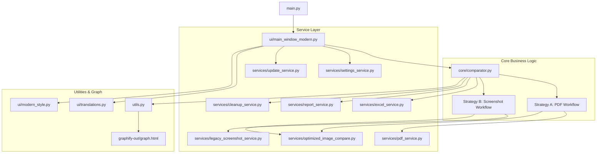

# 📊 Phần Mềm So Sánh Chứng Từ Thanh Toán (CTTT) - Refactored Edition

> **Ứng dụng đối chiếu & so sánh trực quan các bảng tính Chứng Từ Thanh Toán (Excel CTTT Mới vs Cũ) tự động, hiệu năng cao với giao diện hiện đại và thuật toán phát hiện sai khác độ chính xác cao.**

[](https://www.python.org/)
[](https://docs.python.org/3/library/tkinter.html)
[](https://opencv.org/)
[-FF0000)](https://pymupdf.readthedocs.io/)
[](file:///d:/Sandbox/pmsosanhCTTT/Refactored%20so%20s%C3%A1nh%20CTTT%20c%C5%A9%20m%E1%BB%9Bi/Refactored/run_tests.py)

---

## 🌟 Điểm nổi bật & Tính năng chính

- ⚡ **Tốc độ vượt trội với OpenCV & Multithreading**: Tự động so sánh ma trận điểm ảnh với OpenCV và xử lý song song đa luồng (`ThreadPoolExecutor`), tăng tốc độ 10–50x so với phiên bản cũ.
- 🎯 **Phát hiện sai lệch chính xác 100%**: Thuật toán `absdiff` và dynamic mask thresholding phát hiện chuẩn xác từng thay đổi nhỏ (chữ số, ký tự, ngày tháng, mã barcode) mà không gây báo động giả (*false positive*) hay bỏ sót (*false negative*).
- 📄 **Hai chiến lược so sánh linh hoạt (Strategy Pattern)**:
  1. **Phương pháp PDF (Khuyên dùng)**: Xuất các sheet CTTT (màu tab xanh) ra PDF vector chuẩn A4, render ảnh độ phân giải cao (100–300 DPI) và so sánh đối chiếu từng trang.
  2. **Phương pháp Screenshot Cut/Paste (Legacy)**: Tự động điều khiển Excel COM, copy vùng dữ liệu chuẩn `EX:GR`, thiết lập chiều cao dòng và chụp ảnh màn hình so sánh.
- 🎨 **Giao diện Modern UI trực quan**:
  - Hỗ trợ kéo thả sắp xếp cặp file (Drag & Drop confirmation dialog).
  - Bảng chọn màu highlight tùy biến (Base, Outline, Fill Color) và thanh trượt độ trong suốt (Opacity).
  - Chế độ hiển thị màn hình thông minh (PC: Zoom 46%, VPS: Zoom 100%, Secondary Screen: Zoom 60%).
  - Hỗ trợ đa ngôn ngữ (Tiếng Việt 🇻🇳 / English 🇬🇧) chuyển đổi tức thì.
- 📑 **Báo cáo kết quả toàn diện**:
  - Tạo file Excel kết quả độc lập (`Kết quả_PDF_{filename}.xlsx` hoặc `Kết quả_{filename}.xlsx`) chèn trực tiếp ảnh so sánh side-by-side (Cũ bên trái | Mới bên phải có highlight đỏ).
  - Tự động gộp file PDF so sánh tổng hợp (`comparison_ALL_SHEETS.pdf` và `So_sanh_{filename}.pdf`).
- 🛡️ **Quản lý tài nguyên COM & Bộ nhớ an toàn**: Tự động dọn dẹp các tiến trình `EXCEL.EXE` rác, giải phóng RAM sau mỗi file và dọn dẹp thư mục tạm an toàn.

---

## 🏗️ Kiến trúc Tổng quan (Clean Architecture)



---

## 📁 Cấu trúc Thư mục

```text
Refactored/
├── main.py                          # Điểm khởi chạy ứng dụng chính
├── config.py                        # Cấu hình hằng số hệ thống, màu sắc, DPI, đường dẫn
├── utils.py                         # Tiện ích chung: xử lý file, Windows COM, logging UTF-8
├── run_tests.py                     # Trình chạy toàn bộ 29 Unit Test tự động
├── benchmark_performance.py         # Script benchmark đo đạc hiệu năng CPU/RAM
│
├── core/                            # Tầng lõi nghiệp vụ
│   └── comparator.py                # Bộ điều phối so sánh trung tâm (Strategy Router)
│
├── services/                        # Tầng dịch vụ chuyên biệt (Service Layer)
│   ├── excel_service.py             # Quản lý COM Excel, tiền xử lý sheet, unblock file
│   ├── pdf_service.py               # Xuất Excel sang PDF, render ảnh PyMuPDF, gộp PDF
│   ├── optimized_image_compare.py   # Thuật toán so sánh ảnh OpenCV & PIL fallback
│   ├── report_service.py            # Tạo file Excel kết quả & chèn ảnh side-by-side
│   ├── screenshot_service.py        # Dịch vụ chụp ảnh màn hình Excel
│   ├── legacy_screenshot_service.py # Port logic chụp ảnh Cut/Paste từ bản v7.03
│   ├── cleanup_service.py           # Dọn dẹp file tạm, thư mục kết quả cũ, giải phóng RAM
│   ├── settings_service.py          # Lưu trữ và tải cấu hình người dùng (user_settings.json)
│   ├── update_service.py            # Kiểm tra & cập nhật phiên bản mới tự động
│   ├── help_service.py              # Dịch vụ hướng dẫn sử dụng & trạng thái thư viện
│   └── validation_service.py        # Kiểm tra tính hợp lệ của file và tham số cấu hình
│
├── ui/                              # Giao diện người dùng Tkinter
│   ├── main_window_modern.py        # Cửa sổ chính hiện đại (Modern GUI)
│   ├── main_window.py               # Cửa sổ chính giao diện cổ điển
│   ├── modern_style.py              # Hệ thống style, màu sắc, bo góc, card layout
│   ├── translations.py              # Từ điển dịch thuật đa ngôn ngữ (vi, en)
│   ├── ui_utils.py                  # Widgets bổ trợ: ToolTip, DragDropListbox, StatusBar
│   └── help_window.py               # Hộp thoại hướng dẫn phím tắt & tài liệu
│
├── docs/                            # Tài liệu dự án chi tiết
│   ├── USER_GUIDE.md                # Cẩm nang hướng dẫn sử dụng cho người dùng cuối
│   ├── TECHNICAL_SPEC.md            # Đặc tả kỹ thuật & giải thuật nội bộ
│   └── reports/                     # Các báo cáo nghiệm thu & audit hiệu năng
│
├── graphify-out/                    # Đồ thị tri thức Knowledge Graph (Graphify)
│   ├── graph.html                   # Giao diện web tương tác trực quan hóa kiến trúc
│   ├── graph.json                   # Dữ liệu GraphRAG JSON (629 nodes, 979 edges)
│   └── GRAPH_REPORT.md              # Báo cáo phân tích kiến trúc & God Nodes
│
└── tests/                           # Bộ kiểm thử tự động
    ├── test_comparator.py           # Kiểm thử bộ so sánh ảnh & Comparator
    ├── test_excel_service.py        # Kiểm thử tiền xử lý sheet & auto_add_b
    ├── test_pdf_fix_and_logging.py  # Kiểm thử sanitize filename & UTF-8 logging
    └── test_performance_fixes.py   # Kiểm thử giải phóng bộ nhớ & các tối ưu
```

---

## 🚀 Cài đặt & Hướng dẫn Sử dụng

### 1. Yêu cầu Hệ thống
- **Hệ điều hành**: Windows 10 / 11 hoặc Windows Server (Khuyên dùng Windows có cài sẵn Microsoft Excel 2016/2019/2021/365).
- **Python**: Python 3.9 trở lên (Khuyên dùng Python 3.11 hoặc 3.12).

### 2. Cài đặt các thư viện phụ thuộc
Mở terminal PowerShell tại thư mục dự án và chạy:
```powershell
pip install -r requirements.txt
# Hoặc cài đặt các thư viện nòng cốt:
pip install pywin32 pywinauto Pillow PyMuPDF opencv-python reportlab
```

### 3. Khởi chạy ứng dụng
```powershell
python main.py
```

### 4. Quy trình thao tác 4 bước đơn giản:
1. **Bước 1**: Chọn thư mục chứa các file Excel CTTT Mới (hoặc click nút Chọn thư mục).
2. **Bước 2**: Chọn thư mục chứa các file Excel CTTT Cũ tương ứng.
3. **Bước 3**: (Tùy chọn) Điều chỉnh cài đặt:
   - Tích chọn **"Tự động thêm 'b' nếu file cũ không có"** nếu đối chiếu chứng từ có mã vạch barcode.
   - Chọn phương pháp **"Sử dụng phương pháp PDF"** (mặc định được tối ưu tốc độ và độ sắc nét).
4. **Bước 4**: Nhấn nút **"BẮT ĐẦU SO SÁNH"**. Hộp thoại đối chiếu danh sách các cặp file sẽ hiện ra để bạn xác nhận thứ tự trước khi hệ thống tự động xử lý.

---

## 🧪 Chạy Kiểm Thử Tự Động (Automated Testing)

Dự án đi kèm bộ 29 Unit Test kiểm thử tất cả các trường hợp biên, tiền xử lý tên sheet, lọc màu tab xanh, thuật toán so sánh ảnh, và quản lý tiến trình COM:

```powershell
python run_tests.py
```

**Kết quả kiểm thử:**
```text
Ran 29 tests in 0.121s
OK (100% Passed)
```

---

## 🗺️ Đồ thị Tri thức Codebase (Knowledge Graph)

Dự án đã được tích hợp sẵn công cụ **Graphify** phân tích toàn bộ cấu trúc mã nguồn:
- Mở tệp [`graphify-out/graph.html`](file:///d:/Sandbox/pmsosanhCTTT/Refactored%20so%20s%C3%A1nh%20CTTT%20c%C5%A9%20m%E1%BB%9Bi/Refactored/graphify-out/graph.html) trên trình duyệt bất kỳ để khám phá đồ thị 629 nodes, 979 quan hệ và 41 cụm chức năng.
- Báo cáo phân tích chi tiết xem tại [`graphify-out/GRAPH_REPORT.md`](file:///d:/Sandbox/pmsosanhCTTT/Refactored%20so%20s%C3%A1nh%20CTTT%20c%C5%A9%20m%E1%BB%9Bi/Refactored/graphify-out/GRAPH_REPORT.md).

---

## 📚 Tài liệu Liên quan
- 📖 [ARCHITECTURE.md](file:///d:/Sandbox/pmsosanhCTTT/Refactored%20so%20s%C3%A1nh%20CTTT%20c%C5%A9%20m%E1%BB%9Bi/Refactored/ARCHITECTURE.md) - Tài liệu thiết kế kiến trúc hệ thống chi tiết
- 💻 [CODEBASE.md](file:///d:/Sandbox/pmsosanhCTTT/Refactored%20so%20s%C3%A1nh%20CTTT%20c%C5%A9%20m%E1%BB%9Bi/Refactored/CODEBASE.md) - Danh mục module, hàm và quan hệ phụ thuộc
- 👤 [docs/USER_GUIDE.md](file:///d:/Sandbox/pmsosanhCTTT/Refactored%20so%20s%C3%A1nh%20CTTT%20c%C5%A9%20m%E1%BB%9Bi/Refactored/docs/USER_GUIDE.md) - Hướng dẫn sử dụng chi tiết từng chức năng cho người dùng
- 🔧 [docs/TECHNICAL_SPEC.md](file:///d:/Sandbox/pmsosanhCTTT/Refactored%20so%20s%C3%A1nh%20CTTT%20c%C5%A9%20m%E1%BB%9Bi/Refactored/docs/TECHNICAL_SPEC.md) - Đặc tả kỹ thuật giải thuật và các quyết định thiết kế
- 📝 [CHANGELOG.md](file:///d:/Sandbox/pmsosanhCTTT/Refactored%20so%20s%C3%A1nh%20CTTT%20c%C5%A9%20m%E1%BB%9Bi/Refactored/CHANGELOG.md) - Lịch sử cập nhật và nâng cấp phần mềm
